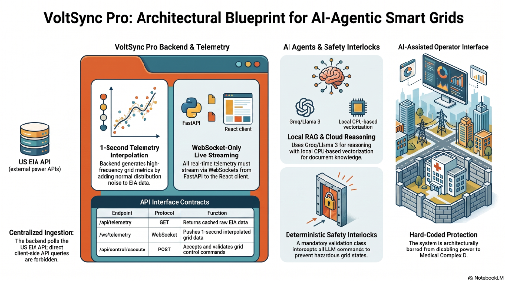

# VoltSync Pro AI ⚡

VoltSync Pro AI is a futuristic, AI-agentic smart grid SCADA dashboard. It integrates real-time telemetry streaming, interactive power sector controls, local semantic retrieval-augmented generation (RAG) manuals, deterministic safety interlocks, and browser-based machine learning forecasting for a complete grid operator command center.

## 🔗 Live Demo

👉 **[voltsync-pro-ai.vercel.app](https://voltsync-pro-ai.vercel.app/)**

---



---

## 🏗️ Architectural Blueprint

VoltSync Pro AI is designed around a decoupled, high-resilience architecture split into four core columns as shown in the blueprint:

1.  **Centralized Ingestion (US EIA API):** 
    Direct client-side queries to external databases are strictly forbidden to protect secrets and prevent rate-limiting. The Python backend handles scheduled background ingestion from the US Energy Information Administration (EIA) API, caching load and generation metrics in the database.
2.  **FastAPI Backend & Telemetry:**
    Features a sub-second telemetry interpolation engine. It reads base states from the database, injects normal-distribution Gaussian noise to simulate fluctuating grid loads, and streams real-time updates over **WebSockets** at 1-second intervals to the React client.
3.  **AI Agents & Safety Interlocks:**
    When grid anomalies are triggered, the SCADA Operator Agent runs a semantic search on local Standard Operating Procedure (SOP) manuals (RAG) and calls the **Groq Llama-3.3** cloud model to formulate mitigation reasoning. All AI recommendations must pass through a strict **Deterministic Safety Interlock** validation class before execution.
4.  **AI-Assisted Operator Interface:**
    A cyberpunk-themed React console. It renders active proposal cards, safety logs, and RAG document citations. Operators can switch between **Advisory** (Human-in-the-Loop approval required) and **Autonomous** (self-healing grid) execution modes.

---

## 🛠️ Technology Stack & APIs

### 1. Frontend (Client Dashboard)
*   **Next.js 15 (App Router):** Production-grade React framework.
*   **React 19 & TypeScript:** Strong static typing for complex grid structures.
*   **Tailwind CSS v4:** Modern styling system with a customized dark-mode glassmorphic theme.
*   **TensorFlow.js:** Runs on-device machine learning models in the client's browser to forecast demand profiles.
*   **Recharts:** High-frequency charting engine used for real-time Supply vs. Demand timeline visualization.
*   **Framer Motion:** Micro-animations for alert notifications and status grids.
*   **Lucide React:** Iconography library.

### 2. Backend (API & Telemetry Server)
*   **FastAPI:** High-performance Python web framework.
*   **Uvicorn:** ASGI server implementation for async routing.
*   **WebSockets:** Full-duplex persistent telemetry connection.
*   **US EIA API v2:** Fetches real-world hourly grid load and net generation statistics.
*   **Psycopg2 & SQLite3:** Database adapters for relational storage.

### 3. AI & RAG Engine
*   **Groq API (Llama-3.3-70b-versatile):** Serves sub-second generative operator recommendations.
*   **Local CPU Semantic Search:** A lightweight, pure-Python keyword TF-IDF cosine-similarity matcher used to index emergency guidelines.
*   **Hugging Face Inference API:** Generates dense semantic vector embeddings (`sentence-transformers/all-MiniLM-L6-v2`) when a token is provided.

### 4. Database Core
*   **Dynamic Dual-Engine (Neon & SQLite):** Automatically matches environment variables on startup.
    *   **Production:** Connects to serverless **Neon PostgreSQL** via `DATABASE_URL`.
    *   **Local Fallback:** Automatically switches to a local `voltsync.db` SQLite file.
*   **Storage Optimization Policy:** To save storage space on serverless platforms, normal grid states are discarded, and only anomalous grid telemetry records, safety interlock breaches, and operator logs are committed to database history.

---

## 🧠 Machine Learning & TensorFlow Integration

VoltSync Pro AI performs on-device load forecasting directly in the user's browser using **TensorFlow.js**. 
*   **Predictive Model:** Located in **[tfForecaster.ts](file:///c:/Users/sahar/Desktop/voltsync-pro-ai/frontend/lib/tfForecaster.ts)**, it compiles a 3-layer sequential feed-forward neural network (dense layers) directly inside the client's browser.
*   **On-the-Fly Training:** The model trains in real-time on the last 20 seconds of grid demand history, dynamically optimizing weights using the Adam optimizer and Mean Squared Error (MSE) loss metrics.
*   **Zero-Latency Forecasting:** Predicts the load consumption trends for the next 5 simulation cycles. The output is rendered as a dashed predictive timeline overlay on the **Recharts** dashboard chart, requiring zero server-side GPU resources.

---

## 📦 Project Libraries & Dependencies

### Python Libraries (Backend)
All backend libraries are configured inside **[requirements.txt](file:///c:/Users/sahar/Desktop/voltsync-pro-ai/backend/requirements.txt)**:
*   `fastapi` — API routing and web core framework.
*   `uvicorn` — ASGI server runtime.
*   `websockets` — Live bi-directional data streaming.
*   `requests` — Synchronous HTTP client for EIA data.
*   `psycopg2-binary` — PostgreSQL adapter for Neon database connection.
*   `python-dotenv` — Environment variables config loader.
*   `pytest` — Unit testing framework.
*   `httpx` — Async HTTP client for mock test assertions.

### Next.js & JavaScript Packages (Frontend)
All JavaScript dependencies are configured inside **[package.json](file:///c:/Users/sahar/Desktop/voltsync-pro-ai/frontend/package.json)**:
*   `next` (v15) — Frontend framework using React server components.
*   `react` & `react-dom` (v19) — UI core rendering.
*   `@tensorflow/tfjs` — In-browser deep learning calculations.
*   `recharts` — SCADA metrics visualization.
*   `framer-motion` — Smooth UI transitions.
*   `lucide-react` — Icon pack.
*   `tailwindcss` & `@tailwindcss/postcss` (v4) — Cyberpunk custom theme styles.
*   `typescript` — Type checking.
*   `eslint` — Code quality checks.

---

## 🚦 API Interface Contracts

| Endpoint | Protocol | Function |
| :--- | :--- | :--- |
| **`GET /api/health`** | HTTP GET | API service health verification. |
| **`WS /ws/telemetry`** | WebSocket | Streams 1-second interpolated grid data with Gaussian noise. |
| **`POST /api/grid/region`** | HTTP POST | Switched ingested telemetry source region (`caiso`, `ercot`, `pjm`, `miso`). |
| **`POST /api/grid/control`** | HTTP POST | Executes manual control actions (`toggle_sector`, `adjust_voltage`, `adjust_demand`). |
| **`GET /api/agent/proposal`** | HTTP GET | Fetches the active stashed AI proposal. |
| **`POST /api/agent/approve`** | HTTP POST | Approves the stashed AI command (Advisory Mode). |
| **`POST /api/agent/reject`** | HTTP POST | Rejects the stashed AI command. |
| **`GET /api/agent/logs`** | HTTP GET | Retrieves historical SCADA audit logs. |

---

## 🚀 Installation & Setup

### 1. Clone & Setup Backend
```bash
cd backend
# Create environment variables file (.env)
cp .env.example .env
# Install dependencies
pip install -r requirements.txt
# Run local FastAPI server
python -m uvicorn app.main:app --reload
```

### 2. Setup Frontend
```bash
cd frontend
# Create environment variables file (.env)
cp .env.example .env
# Install node packages
npm install
# Run development server
npm run dev
```
Then open `http://localhost:3000` (or `http://localhost:3001` if port 3000 is occupied) to access the console!

---

If you like this project, please give it a ⭐ on GitHub!
